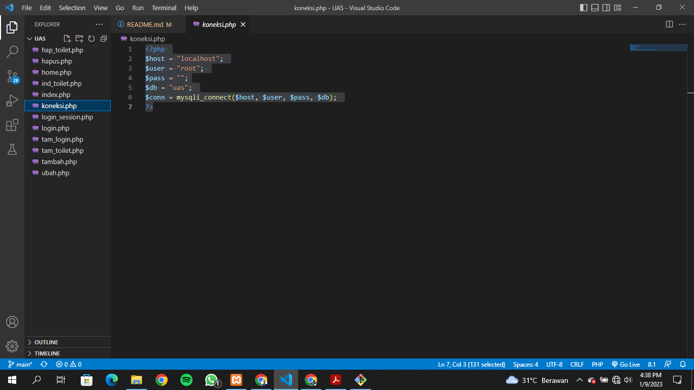
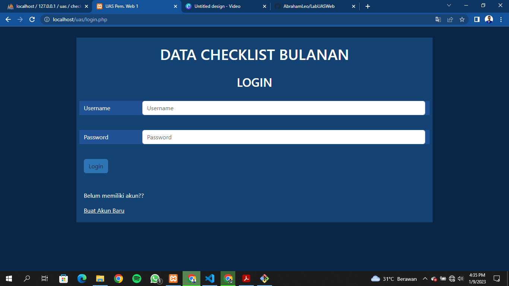

# LabUASWeb

## 1.	Membuat database users

## 2.	Membuat databse toilet

## 3.	Membuat database users

## 4.	Membuat Koneksi.php

## 5.	Membuat Halaman Login
Halaman ini berfungsi sebagai halaman awal saat membuka website ini

## 6.	Membuat login_session.php

## 7.	Membuat form penambahan akun
Buat file tam_login.php untuk membuat akun baru yang akan terkonek dengan database users diphpmyadmin

## 8.	Membuat home.php
Membuat file untuk tampilan dasar dari menu awal website ini

## 9.	Membuat index.php
File ini untuk menampilkan data dari databse checklist yang sudah kita input

## 10.	Membuat file tambah.php
Berfungsi untuk menambahkan data checklist yg akan diinput

## 11.	Membuat file ubah.php
Membuat file ini untuk mengudah data index checklist

## 12.	Membuat hapus.php
Berfungsi untuk menghapus data yang ingin kita hilangkan dari database checklist

## 13.	Membuat ind_toilet.php
Untuk menampilkan data toilet apa saja yang sudah kita input

## 14.	Membuat file tam_toilet.php
File ini berfungsi untuk menambahkan data ke databse toilet

## 15.	Membuat file hap_toilet.php
Tujuannya untuk menghapus data toilet dari database toilet

